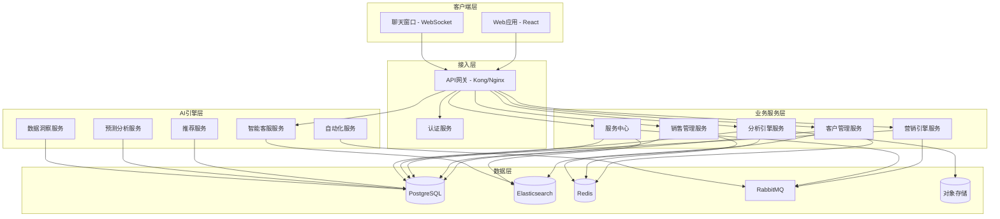
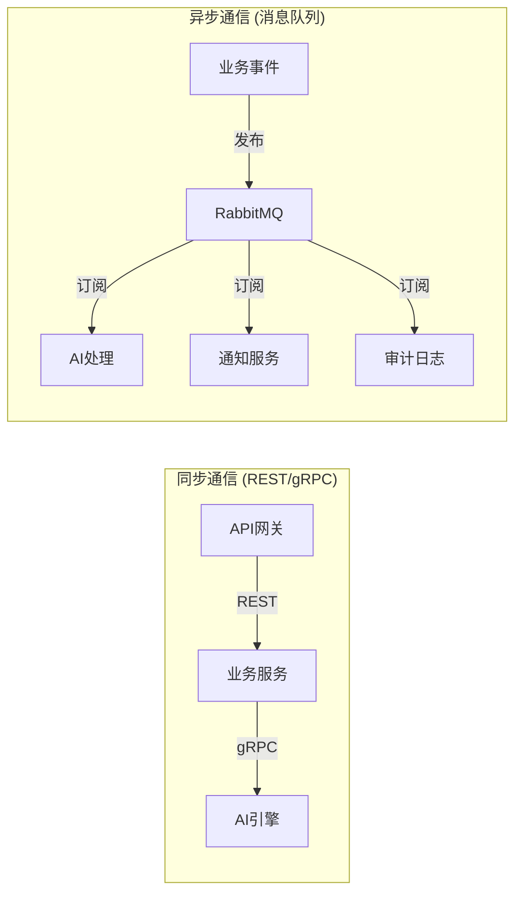
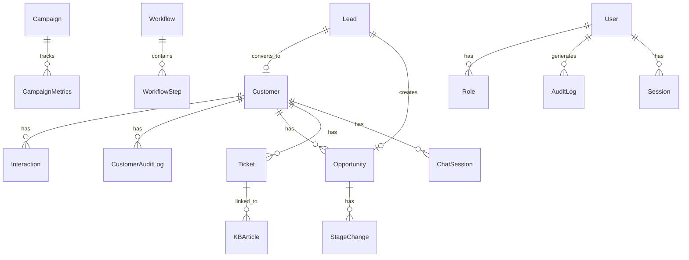

# Design Document: AI赋能CRM系统

## Overview

本设计文档描述了一个AI赋能的客户关系管理（CRM）系统的技术架构和实现方案。该系统采用微服务架构，将业务功能划分为独立的服务模块，通过API网关统一对外提供服务。AI能力作为独立的引擎层，为各业务模块提供智能增强功能。

### 设计目标

- **可扩展性**: 各模块独立部署和扩缩容，支持业务增长
- **高可用性**: 核心服务99.9%可用性，AI服务降级不影响基础功能
- **安全性**: 端到端加密、RBAC权限控制、完整审计日志
- **智能化**: AI能力贯穿客户管理、销售、营销和服务全流程
- **响应性能**: 核心查询500ms内响应，AI推荐3秒内返回

### 技术栈选型

| 层级 | 技术选择 | 理由 |
|------|---------|------|
| 后端框架 | Node.js + TypeScript + NestJS | 类型安全、模块化架构、企业级支持 |
| 数据库 | PostgreSQL | 关系型数据、复杂查询、JSONB支持 |
| 搜索引擎 | Elasticsearch | 全文检索、模糊匹配、500ms响应要求 |
| 缓存 | Redis | 热数据缓存、会话管理、实时指标 |
| 消息队列 | RabbitMQ | 异步任务处理、事件驱动、工作流执行 |
| AI/ML | Python + FastAPI | ML生态成熟、模型服务独立部署 |
| 前端 | React + TypeScript | 组件化UI、360度视图、拖拽式报表 |
| 对象存储 | S3兼容存储 | 文档、附件、导出文件存储 |

## Architecture

### 系统架构图



### 服务间通信



### 架构设计决策

1. **微服务 vs 单体**: 选择微服务架构，因为各模块（客户管理、销售、营销、服务、AI）有独立的扩展需求和团队边界。
2. **AI引擎独立部署**: AI服务使用Python/FastAPI独立部署，与业务服务解耦，支持GPU资源独立调配和模型热更新。
3. **事件驱动**: 跨服务协作（如线索转化创建客户和商机）通过消息队列解耦，保证最终一致性。
4. **CQRS模式**: 分析引擎采用CQRS模式，写入用PostgreSQL，查询用预计算物化视图+Redis缓存，满足3秒内加载要求。

## Components and Interfaces

### API网关接口

所有外部请求通过API网关进入，统一处理认证、限流和路由。

```typescript
// API网关路由配置
interface GatewayRoute {
  path: string;
  service: string;
  methods: HttpMethod[];
  rateLimit: { requests: number; window: string };
  auth: boolean;
}
```

### 客户管理服务 (Customer Service)

```typescript
interface CustomerService {
  // 客户CRUD
  createCustomer(data: CreateCustomerDTO): Promise<Customer>;
  getCustomer(id: string): Promise<Customer>;
  updateCustomer(id: string, data: UpdateCustomerDTO): Promise<Customer>;
  deleteCustomer(id: string): Promise<void>;
  
  // 搜索
  searchCustomers(query: SearchQuery): Promise<PaginatedResult<Customer>>;
  
  // 交互历史
  addInteraction(customerId: string, interaction: InteractionDTO): Promise<Interaction>;
  getInteractions(customerId: string, pagination: PaginationParams): Promise<PaginatedResult<Interaction>>;
  
  // 360度视图
  getCustomer360View(customerId: string): Promise<Customer360View>;
  
  // 重复检测
  checkDuplicate(contact: ContactInfo): Promise<DuplicateCheckResult>;
}
```

### 销售管理服务 (Sales Service)

```typescript
interface SalesService {
  // 线索管理
  createLead(data: CreateLeadDTO): Promise<Lead>;
  updateLeadStatus(leadId: string, status: LeadStatus, note?: string): Promise<Lead>;
  convertLead(leadId: string): Promise<{ customer: Customer; opportunity: Opportunity }>;
  batchAssignLeads(leadIds: string[], salesPersonId: string): Promise<BatchResult>;
  
  // 商机管理
  createOpportunity(data: CreateOpportunityDTO): Promise<Opportunity>;
  updateOpportunityStage(id: string, stage: OpportunityStage, note: string): Promise<Opportunity>;
  markWon(id: string): Promise<Opportunity>;
  markLost(id: string, reason: LossReason, note: string): Promise<Opportunity>;
  
  // 销售漏斗
  getSalesFunnel(filters: FunnelFilters): Promise<SalesFunnel>;
  getPerformanceMetrics(userId: string, period: MetricPeriod): Promise<SalesMetrics>;
}
```

### 营销引擎服务 (Marketing Service)

```typescript
interface MarketingService {
  // 营销活动
  createCampaign(data: CreateCampaignDTO): Promise<Campaign>;
  updateCampaignStatus(id: string, status: CampaignStatus): Promise<Campaign>;
  getCampaignMetrics(id: string): Promise<CampaignMetrics>;
  generateCampaignReport(id: string): Promise<CampaignReport>;
  
  // 自动化工作流
  createWorkflow(data: CreateWorkflowDTO): Promise<Workflow>;
  activateWorkflow(id: string): Promise<Workflow>;
  pauseWorkflow(id: string): Promise<Workflow>;
  getWorkflowStats(id: string): Promise<WorkflowStats>;
  
  // 受众细分
  createSegment(criteria: SegmentCriteria): Promise<AudienceSegment>;
}
```

### 服务中心 (Service Center)

```typescript
interface ServiceCenter {
  // 工单管理
  createTicket(data: CreateTicketDTO): Promise<Ticket>;
  updateTicketStatus(id: string, status: TicketStatus): Promise<Ticket>;
  assignTicket(id: string, agentId: string): Promise<Ticket>;
  autoRouteTicket(id: string): Promise<Ticket>;
  
  // 知识库
  searchKnowledgeBase(query: string): Promise<KBSearchResult[]>;
  createArticle(data: CreateArticleDTO): Promise<KBArticle>;
  updateArticle(id: string, data: UpdateArticleDTO): Promise<KBArticle>;
  
  // SLA管理
  checkSLABreaches(): Promise<SLABreachResult[]>;
}
```

### 分析引擎服务 (Analytics Service)

```typescript
interface AnalyticsService {
  // 仪表盘
  getDashboard(templateId: string): Promise<Dashboard>;
  getKPIMetrics(): Promise<KPIMetrics>;
  
  // 自定义报表
  createReport(config: ReportConfig): Promise<Report>;
  exportReport(id: string, format: ExportFormat): Promise<ExportResult>;
  scheduleReport(id: string, schedule: ReportSchedule): Promise<ScheduledReport>;
  
  // 数据下钻
  drillDown(metricId: string, dimensions: string[]): Promise<DrillDownResult>;
}
```

### AI引擎服务接口

```typescript
// AI推荐服务
interface AIRecommendationService {
  getNextActions(entityId: string, entityType: 'lead' | 'opportunity'): Promise<ActionRecommendation[]>;
  getBestContactTime(customerId: string): Promise<ContactTimeSlot[]>;
  getDailyPriorityList(userId: string): Promise<PriorityItem[]>;
  recordFeedback(recommendationId: string, accepted: boolean): Promise<void>;
}

// AI预测服务
interface AIPredictionService {
  getWinProbability(opportunityId: string): Promise<WinProbabilityScore>;
  getChurnRisk(customerId: string): Promise<ChurnRiskScore>;
  getRevenueForecast(period: ForecastPeriod): Promise<RevenueForecast>;
  updateModels(): Promise<ModelUpdateResult>;
}

// AI自动化服务
interface AIAutomationService {
  classifyLead(leadId: string): Promise<LeadClassification>;
  generateFollowUpDraft(context: ConversationContext): Promise<EmailDraft>;
  suggestTicketResolution(ticketId: string): Promise<TicketSuggestion>;
  detectDuplicates(customerId: string): Promise<DuplicateDetection[]>;
  extractDataFromDocument(document: UploadedDocument): Promise<ExtractedData>;
}

// AI智能客服服务
interface AIChatbotService {
  processMessage(sessionId: string, message: string): Promise<ChatResponse>;
  startSession(customerId: string): Promise<ChatSession>;
  endSession(sessionId: string): Promise<SessionSummary>;
  escalateToHuman(sessionId: string): Promise<EscalationResult>;
}

// AI数据洞察服务
interface AIInsightService {
  detectAnomalies(): Promise<AnomalyAlert[]>;
  identifyCrossSellOpportunities(customerId: string): Promise<CrossSellOpportunity[]>;
  generateWeeklySummary(): Promise<WeeklyInsightSummary>;
  queryNaturalLanguage(query: string): Promise<NLQueryResult>;
}
```

### 认证与权限服务

```typescript
interface AuthService {
  // 认证
  login(credentials: LoginCredentials): Promise<AuthToken>;
  loginSSO(provider: SSOProvider, token: string): Promise<AuthToken>;
  logout(sessionId: string): Promise<void>;
  refreshToken(refreshToken: string): Promise<AuthToken>;
  
  // 权限
  checkPermission(userId: string, resource: string, action: string): Promise<boolean>;
  getUserRoles(userId: string): Promise<Role[]>;
  
  // 会话管理
  validateSession(sessionId: string): Promise<SessionInfo>;
  terminateIdleSession(sessionId: string): Promise<void>;
}
```

## Data Models

### 客户数据模型

```typescript
interface Customer {
  id: string;                    // UUID
  name: string;                  // 必填，客户姓名
  email?: string;                // 邮箱（电话/邮箱至少一项）
  phone?: string;                // 电话（电话/邮箱至少一项）
  company?: string;              // 公司名称
  industry?: string;             // 行业
  region?: string;               // 地区
  sourceChannel?: string;        // 来源渠道
  tags: string[];                // 自定义标签，最多20个
  size?: CompanySize;            // 企业规模
  createdAt: Date;
  updatedAt: Date;
  createdBy: string;             // 创建用户ID
}

interface Interaction {
  id: string;
  customerId: string;
  type: 'call' | 'email' | 'meeting' | 'note';
  summary: string;               // 内容摘要
  timestamp: Date;
  userId: string;                // 操作用户
}

interface CustomerAuditLog {
  id: string;
  customerId: string;
  userId: string;                // 操作用户
  modifiedAt: Date;
  fieldName: string;
  oldValue: string;
  newValue: string;
}
```

### 销售数据模型

```typescript
type LeadStatus = 'new' | 'contacted' | 'qualified' | 'converted' | 'lost';
type OpportunityStage = 'discovery' | 'qualification' | 'proposal' | 'negotiation' | 'won' | 'lost';
type LossReason = 'price' | 'competitor' | 'requirement_change' | 'no_response' | 'other';

interface Lead {
  id: string;
  contactName: string;           // 必填
  email?: string;                // 电话/邮箱至少一项
  phone?: string;                // 电话/邮箱至少一项
  sourceChannel: string;         // 来源渠道
  status: LeadStatus;
  assignedTo?: string;           // 分配的销售人员ID
  isStale: boolean;              // 是否停滞
  lastActivityAt: Date;          // 最后活动时间
  createdAt: Date;
  updatedAt: Date;
}

// 允许的线索状态转换
const LEAD_TRANSITIONS: Record<LeadStatus, LeadStatus[]> = {
  'new': ['contacted', 'lost'],
  'contacted': ['qualified', 'lost'],
  'qualified': ['converted', 'lost'],
  'converted': [],
  'lost': [],
};

interface Opportunity {
  id: string;
  name: string;                  // 最多100字符
  amount: number;                // 0.01 ~ 999,999,999.99
  expectedCloseDate: Date;
  ownerId: string;               // 负责人
  customerId: string;            // 关联客户
  stage: OpportunityStage;
  isOverdue: boolean;            // 是否逾期
  createdAt: Date;
  updatedAt: Date;
}

interface StageChange {
  id: string;
  opportunityId: string;
  fromStage: OpportunityStage;
  toStage: OpportunityStage;
  note: string;                  // 至少10字符
  changedAt: Date;
  changedBy: string;
}
```

### 营销数据模型

```typescript
type CampaignType = 'email' | 'sms' | 'social_media' | 'offline';
type CampaignStatus = 'draft' | 'scheduled' | 'running' | 'paused' | 'ended';
type WorkflowStatus = 'draft' | 'active' | 'paused' | 'archived';

interface Campaign {
  id: string;
  name: string;                  // 最多100字符
  type: CampaignType;
  targetAudience: AudienceSegment;
  budget: number;                // 0.01 ~ 99,999,999.99
  startDate: Date;
  endDate: Date;                 // 必须晚于startDate
  status: CampaignStatus;
  metrics: CampaignMetrics;
  createdBy: string;
  createdAt: Date;
}

interface CampaignMetrics {
  totalDelivered: number;
  openRate: number;
  clickRate: number;
  conversionRate: number;
  totalSpend: number;
  roi?: number;                  // (收入-花费)/花费
  deliveryFailureRate: number;
}

interface Workflow {
  id: string;
  name: string;
  status: WorkflowStatus;
  steps: WorkflowStep[];         // 最多50个节点
  triggerType: 'time' | 'event' | 'behavior';
  triggerConfig: Record<string, unknown>;
  stats: WorkflowStats;
  createdBy: string;
  createdAt: Date;
}

interface WorkflowStep {
  id: string;
  type: 'send_email' | 'send_sms' | 'create_task' | 'update_tag' | 'assign_sales';
  config: Record<string, unknown>;
  nextStepId?: string;
  conditionExpression?: string;
}

interface WorkflowStats {
  triggerCount: number;
  actionsExecuted: number;
  successRate: number;
  failureRate: number;
}
```

### 服务工单数据模型

```typescript
type TicketPriority = 'urgent' | 'high' | 'medium' | 'low';
type TicketStatus = 'pending' | 'in_progress' | 'waiting_customer' | 'resolved' | 'closed';
type TicketChannel = 'phone' | 'email' | 'web_form' | 'live_chat';

// SLA阈值（小时）
const SLA_THRESHOLDS: Record<TicketPriority, number> = {
  'urgent': 1,
  'high': 4,
  'medium': 8,
  'low': 24,
};

// 允许的工单状态转换
const TICKET_TRANSITIONS: Record<TicketStatus, TicketStatus[]> = {
  'pending': ['in_progress'],
  'in_progress': ['waiting_customer', 'resolved'],
  'waiting_customer': ['in_progress'],
  'resolved': ['closed', 'in_progress'],  // 可重新打开
  'closed': [],
};

interface Ticket {
  id: string;
  ticketNumber: string;          // 唯一工单编号
  customerId: string;
  description: string;
  channel: TicketChannel;
  priority: TicketPriority;
  status: TicketStatus;
  assignedTo?: string;
  category?: string;
  slaDeadline: Date;
  createdAt: Date;
  resolvedAt?: Date;
}

interface KBArticle {
  id: string;
  title: string;
  content: string;
  tags: string[];                // 最多10个
  categoryPath: string[];        // 最多3级
  version: number;
  viewCount: number;
  helpfulScore: number;          // 1-5平均分
  linkedTicketCount: number;
  status: 'published' | 'draft' | 'archived';
  createdAt: Date;
  updatedAt: Date;
}
```

### AI数据模型

```typescript
interface ActionRecommendation {
  id: string;
  entityId: string;
  entityType: 'lead' | 'opportunity';
  actionType: 'call' | 'email' | 'meeting' | 'send_material' | 'create_followup';
  description: string;
  confidence: number;            // 0-100
  createdAt: Date;
}

interface WinProbabilityScore {
  opportunityId: string;
  score: number;                 // 0-100
  factors: ScoreFactor[];
  calculatedAt: Date;
}

interface ChurnRiskScore {
  customerId: string;
  score: number;                 // 0-100, >=70为高风险
  riskFactors: RiskFactor[];
  retentionActions: RetentionAction[];
  calculatedAt: Date;
}

interface RevenueForecast {
  period: string;
  predictedAmount: number;
  confidenceInterval: {
    lower: number;
    upper: number;
    confidence: number;          // 0.95
  };
  generatedAt: Date;
}

interface ChatSession {
  id: string;
  customerId: string;
  messages: ChatMessage[];       // 最多50轮
  status: 'active' | 'escalated' | 'ended';
  startedAt: Date;
  lastActivityAt: Date;
  summary?: SessionSummary;
}

interface ChatMessage {
  id: string;
  role: 'customer' | 'bot' | 'agent';
  content: string;               // 客户消息最多2000字符
  confidence?: number;           // bot消息的置信度
  timestamp: Date;
}

interface AnomalyAlert {
  id: string;
  metricName: string;
  currentValue: number;
  expectedRange: { min: number; max: number };
  deviation: number;             // 标准差倍数
  potentialCauses: string[];     // 最多3条
  detectedAt: Date;
}

interface WeeklyInsightSummary {
  generatedAt: Date;
  insights: Insight[];           // 3-10条
}

interface Insight {
  category: 'trend' | 'risk' | 'opportunity';
  description: string;           // 自然语言描述
  relatedMetrics: string[];
  severity: 'info' | 'warning' | 'critical';
}
```

### 权限与审计数据模型

```typescript
interface User {
  id: string;
  username: string;
  email: string;
  roles: Role[];
  isLocked: boolean;
  failedLoginAttempts: number;
  lastLoginAt?: Date;
  createdAt: Date;
}

interface Role {
  id: string;
  name: string;
  permissions: Permission[];
}

interface Permission {
  resource: string;              // 模块或记录类型
  actions: ('view' | 'create' | 'edit' | 'delete' | 'manage')[];
  scope: 'own' | 'team' | 'all'; // 记录级别权限
}

interface AuditLog {
  id: string;
  timestamp: Date;
  userId: string;
  action: string;
  resource: string;
  resourceId: string;
  result: 'success' | 'denied' | 'error';
  details?: Record<string, unknown>;
}

interface Session {
  id: string;
  userId: string;
  createdAt: Date;
  lastActivityAt: Date;
  expiresAt: Date;               // lastActivityAt + 30分钟
  isActive: boolean;
}
```

### 数据库Schema设计



## Correctness Properties

*A property is a characteristic or behavior that should hold true across all valid executions of a system-essentially, a formal statement about what the system should do. Properties serve as the bridge between human-readable specifications and machine-verifiable correctness guarantees.*

### Property 1: 客户创建验证

*For any* 客户数据，创建操作应成功当且仅当数据包含非空姓名且至少包含一种有效联系方式（电话或邮箱）。缺少必填字段的数据应被拒绝且不产生任何数据变更。

**Validates: Requirements 1.1, 1.7**

### Property 2: 客户搜索结果约束

*For any* 搜索查询，返回的客户结果集大小应不超过50条，且每条结果应在姓名、公司、电话或邮箱字段上与查询词匹配（前缀匹配或模糊匹配）。

**Validates: Requirements 1.2**

### Property 3: 交互历史完整性

*For any* 添加到客户的交互记录，存储后的记录应包含时间戳、类型（通话/邮件/会议/备注之一）、内容摘要和操作用户ID，且这些字段的值与输入一致。

**Validates: Requirements 1.3**

### Property 4: 客户修改审计追踪

*For any* 客户字段更新操作，系统应生成审计日志条目，包含修改时间戳、执行用户、字段名称以及正确的修改前值和修改后值。

**Validates: Requirements 1.4**

### Property 5: 自定义标签数量限制

*For any* 客户标签分配操作，标签总数不超过20个时应成功，超过20个时应被拒绝。

**Validates: Requirements 1.5**

### Property 6: 重复客户检测

*For any* 新客户创建请求，若系统中已存在具有相同邮箱或电话的客户记录，则系统应返回重复警告和合并建议。

**Validates: Requirements 1.6**

### Property 7: 360度视图数据完整性

*For any* 客户及其关联数据（交互历史、商机、工单、购买记录），360度视图应包含该客户所有关联实体的信息。

**Validates: Requirements 2.1**

### Property 8: 交互时间线排序

*For any* 客户交互记录集合，时间线视图应按时间戳降序排列，默认返回不超过50条记录。

**Validates: Requirements 2.3**

### Property 9: 线索创建验证

*For any* 线索数据，创建操作应成功当且仅当数据包含联系人姓名且至少包含一项联系方式（电话或邮箱），且新建线索的状态应为"新建"并包含正确的创建时间戳和来源渠道。

**Validates: Requirements 3.1, 3.2, 3.7**

### Property 10: 状态机转换合法性

*For any* 实体状态转换请求（线索、工单、营销活动、工作流），系统应仅允许预定义的合法转换路径，非法转换应被拒绝且实体状态保持不变。

**Validates: Requirements 3.3, 5.6, 6.6, 7.3**

### Property 11: 线索转化一致性

*For any* 被转化的线索，系统应创建关联的商机记录；如果系统中已存在相同联系方式的客户，则商机应关联到已有客户而非创建重复客户记录。

**Validates: Requirements 3.4**

### Property 12: 线索停滞检测

*For any* 线索，若其最后活动时间距今超过30天且状态不为"已转化"或"已丢失"，则该线索应被标记为"停滞"。

**Validates: Requirements 3.6**

### Property 13: 商机字段验证

*For any* 商机数据，商机名称不应超过100个字符，预估金额应在0.01至999,999,999.99范围内，且必须包含预计关闭日期、负责人和关联客户。

**Validates: Requirements 4.1**

### Property 14: 销售漏斗统计一致性

*For any* 商机数据集和时间筛选范围，销售漏斗中每个阶段显示的商机数量和金额合计应与该阶段实际商机数据精确匹配。

**Validates: Requirements 4.2**

### Property 15: 阶段变更记录约束

*For any* 商机阶段变更操作，备注长度不少于10个字符时应成功并记录完整的变更记录（时间戳、变更方向、备注），少于10字符时应被拒绝。

**Validates: Requirements 4.3**

### Property 16: 销售绩效指标计算

*For any* 商机数据集，系统计算的赢单率应等于赢单数除以（赢单数+丢单数），平均交易金额应等于赢单总金额除以赢单数，平均销售周期应等于赢单商机从创建到赢单的平均天数。

**Validates: Requirements 4.4**

### Property 17: 丢单原因必填

*For any* 商机标记为丢单的操作，必须包含有效的丢单原因（价格、竞争对手、需求变更、无响应或其他）和备注，否则操作应被拒绝。

**Validates: Requirements 4.6**

### Property 18: 商机逾期检测

*For any* 商机，若当前日期已超过其预计关闭日期且商机阶段不为"赢单"或"丢单"，则该商机应被标记为"逾期"。

**Validates: Requirements 4.7**

### Property 19: 营销活动验证

*For any* 营销活动创建数据，名称不应超过100个字符，预算应在0.01至99,999,999.99范围内，且结束日期必须严格晚于开始日期。违反任一条件的创建请求应被拒绝。

**Validates: Requirements 5.1**

### Property 20: 受众细分正确性

*For any* 客户集合和受众细分条件（行业、地区、购买历史、参与度），返回的客户列表中每位客户都应满足所有指定的筛选条件。

**Validates: Requirements 5.4**

### Property 21: 活动ROI计算

*For any* 已结束的营销活动，其ROI计算结果应等于（活动产生收入 - 活动花费）/ 活动花费。

**Validates: Requirements 5.5**

### Property 22: 活动自动暂停阈值

*For any* 执行中的营销活动，当其投递失败率严格超过20%时应被自动暂停，不超过20%时应继续运行。

**Validates: Requirements 5.7**

### Property 23: 工作流统计准确性

*For any* 活动状态的工作流及其执行记录集合，统计数据中的已触发次数、已执行动作数、成功率和失败率应与实际执行记录精确匹配。

**Validates: Requirements 6.5**

### Property 24: 工单创建与优先级分配

*For any* 有效的工单创建请求，系统应成功创建工单，分配基于分类和关键词的优先级，并生成唯一的工单编号。

**Validates: Requirements 7.1, 7.2**

### Property 25: 工单自动路由合理性

*For any* 新创建或重新分配的工单，系统应在考虑工单分类、优先级和客服人员当前工单负载的基础上完成路由，确保分配给的客服人员是当前未关闭工单数量最少的合格人员之一。

**Validates: Requirements 7.4**

### Property 26: SLA升级逻辑

*For any* 未解决的工单，若其存续时间超过对应优先级的SLA阈值（紧急1小时、高4小时、中8小时、低24小时），则其优先级应被提升一级。

**Validates: Requirements 7.5**

### Property 27: 工单超时规则

*For any* 处于"等待客户回复"状态的工单，超过72小时应触发提醒通知，超过7天应自动标记为"已解决"。

**Validates: Requirements 7.7, 7.8**

### Property 28: 知识库搜索约束

*For any* 知识库搜索查询，返回结果不超过20条，且结果应按相关性排序。

**Validates: Requirements 8.2**

### Property 29: 文章标签和分类约束

*For any* 知识库文章，标签数量不超过10个，分类层级不超过3级。超出限制的操作应被拒绝。

**Validates: Requirements 8.4**

### Property 30: 自定义报表约束

*For any* 报表配置，筛选条件不超过10个，分组层级不超过3层。超出限制的配置应被拒绝。

**Validates: Requirements 9.2**

### Property 31: 数据导出行数限制

*For any* 数据导出请求，导出结果的记录数不超过100,000行。

**Validates: Requirements 9.3**

### Property 32: AI推荐输出有效性

*For any* 线索或商机的下一步行动推荐请求，系统应返回1至5条推荐，每条推荐应包含有效的行动类型和0至100之间的置信度评分。

**Validates: Requirements 10.1, 10.4**

### Property 33: 最佳联系时间有效性

*For any* 客户的最佳联系时间预测，输出应为未来7天内的时间段列表，以1小时为粒度。

**Validates: Requirements 10.2**

### Property 34: 每日优先列表约束

*For any* 销售用户的每日优先任务列表，列表项数不超过10项。

**Validates: Requirements 10.3**

### Property 35: 数据不足时的降级行为

*For any* 历史交互记录少于3条的客户，AI推荐应返回明确的数据不足提示并提供基于同类客户画像的通用建议。

**Validates: Requirements 10.6**

### Property 36: AI评分范围有效性

*For any* AI生成的评分（商机赢单概率、客户流失风险），其值应在0至100的整数范围内。流失风险评分达到70分及以上的客户应被标识为高流失风险。

**Validates: Requirements 11.1, 11.2**

### Property 37: 高流失风险告警

*For any* 流失风险评分超过70的客户，系统应生成告警并推荐至少1条具体挽留措施。

**Validates: Requirements 11.3**

### Property 38: 收入预测置信区间

*For any* 收入预测结果，应包含95%置信区间，且置信区间下界 ≤ 预测值 ≤ 置信区间上界。

**Validates: Requirements 11.4**

### Property 39: 线索自动分类置信度标记

*For any* AI自动分类的线索，若分类置信度低于70%，则分类结果应标记为"待确认"。

**Validates: Requirements 12.1**

### Property 40: AI生成内容标记

*For any* AI自动生成的跟进邮件草稿，应标记为"AI生成"并设置为需要用户确认后方可发送的状态。

**Validates: Requirements 12.2**

### Property 41: 工单AI建议约束

*For any* 新工单的AI分析建议，应包含分类建议、优先级建议和不超过3条的潜在解决方案。

**Validates: Requirements 12.3**

### Property 42: 重复客户检测阈值

*For any* 两个客户记录，若姓名相似度达到85%以上或联系信息精确匹配，则应被标记为疑似重复，且合并操作必须经过用户确认。

**Validates: Requirements 12.4**

### Property 43: 聊天消息长度验证

*For any* 客户发送的聊天消息，长度超过2000个字符时应被拒绝。

**Validates: Requirements 13.1**

### Property 44: 低置信度对话转接

*For any* AI客服响应，若置信度低于80%，则对话应被转接至人工客服，转接内容应包含完整对话记录、客户基本信息和当前问题分类。

**Validates: Requirements 13.3**

### Property 45: 会话约束

*For any* 聊天会话，对话轮次不超过50轮，空闲超过15分钟的会话应自动结束。

**Validates: Requirements 13.5**

### Property 46: 对话摘要完整性

*For any* 结束的聊天会话，生成的摘要应包含客户核心问题、已尝试的解决方案和当前状态三个要素。

**Validates: Requirements 13.6**

### Property 47: 异常检测阈值

*For any* 业务指标数据，当指标值偏离过去90天滚动基线超过2个标准差时应被检测为异常，未超过时不应触发告警。

**Validates: Requirements 14.1**

### Property 48: 异常通知完整性

*For any* 检测到的异常，通知应包含指标名称、当前值、预期范围、偏离程度和不超过3条的潜在原因。

**Validates: Requirements 14.2**

### Property 49: 交叉销售机会过滤

*For any* AI识别的交叉销售和向上销售机会，仅置信度不低于60的机会应被展示给用户。

**Validates: Requirements 14.3**

### Property 50: 每周洞察摘要约束

*For any* 每周业务洞察摘要，应包含至少3条且不超过10条洞察，涵盖趋势、风险和机会三个类别。

**Validates: Requirements 14.4**

### Property 51: 自然语言查询降级

*For any* 无法解析的自然语言查询，系统应返回提示信息并提供不超过3条相似的可用查询建议。

**Validates: Requirements 14.6**

### Property 52: 角色权限控制

*For any* 用户对资源的访问请求，系统应根据该用户的角色和权限配置决定是否允许访问，未授权的访问应被拒绝。

**Validates: Requirements 15.2, 15.9**

### Property 53: 审计日志完整性

*For any* 系统操作，审计日志条目应包含操作时间戳、操作用户、操作类型、目标资源和操作结果。

**Validates: Requirements 15.4**

### Property 54: 会话空闲超时

*For any* 用户会话，若最后活动时间距今超过30分钟，该会话应被终止且用户需要重新认证。

**Validates: Requirements 15.5**

### Property 55: 账户锁定机制

*For any* 用户账户，连续5次认证失败后应被锁定15分钟，且锁定事件应记录到审计日志。

**Validates: Requirements 15.7**

## Error Handling

### 错误处理策略

系统采用分层错误处理策略，确保错误被正确捕获、记录和反馈。

### API层错误响应格式

```typescript
interface APIErrorResponse {
  code: string;         // 错误码，如 'VALIDATION_ERROR'
  message: string;      // 用户友好的错误描述
  details?: ErrorDetail[];
  requestId: string;    // 请求追踪ID
  timestamp: string;
}

interface ErrorDetail {
  field?: string;
  constraint: string;
  message: string;
}
```

### 错误分类

| 错误类别 | HTTP状态码 | 处理方式 |
|---------|-----------|---------|
| 输入验证错误 | 400 | 返回详细字段级错误信息 |
| 认证失败 | 401 | 终止会话，记录审计日志 |
| 权限不足 | 403 | 拒绝请求，记录未授权访问 |
| 资源不存在 | 404 | 返回明确的未找到提示 |
| 状态冲突 | 409 | 返回当前状态和可用转换 |
| 服务限流 | 429 | 返回重试时间建议 |
| 服务器内部错误 | 500 | 记录详细错误，返回通用错误信息 |
| 服务不可用 | 503 | 触发降级策略 |

### 降级策略

1. **AI服务不可用**: 业务功能正常运行，AI增强功能（推荐、预测）降级为不可用状态，前端显示"智能功能暂时不可用"提示
2. **搜索引擎不可用**: 回退到数据库LIKE查询，响应时间可能增加但功能可用
3. **缓存不可用**: 直接查询数据库，记录告警并自动重连
4. **消息队列不可用**: 异步任务写入本地重试队列，服务恢复后补发
5. **SSO身份提供商不可用**: 回退到本地凭证认证，通知管理员
6. **AI模型更新失败**: 继续使用上一版本模型，通知系统管理员

### 重试策略

| 场景 | 最大重试次数 | 重试间隔 | 超时后动作 |
|------|------------|---------|-----------|
| 工作流动作执行 | 3次 | 指数退避（1h内） | 记录失败，通知创建者 |
| 定时报表发送 | 1次 | 30分钟 | 通知报表所有者 |
| 消息投递 | 3次 | 指数退避 | 记录失败，更新失败率 |
| 数据库连接 | 5次 | 1s, 2s, 4s, 8s, 16s | 服务标记为不健康 |

### 数据一致性保障

- **事务边界**: 单服务内操作使用数据库事务保证ACID
- **跨服务操作**: 使用Saga模式保证最终一致性（如线索转化涉及客户服务和销售服务）
- **幂等性**: 所有写操作支持幂等重试，通过requestId去重
- **并发控制**: 使用乐观锁（版本号）防止并发更新冲突

## Testing Strategy

### 测试分层

```
┌─────────────────────────────────────┐
│         E2E Tests (少量)             │  关键业务流程端到端验证
├─────────────────────────────────────┤
│       Integration Tests              │  服务间交互、数据库、消息队列
├─────────────────────────────────────┤
│     Property-Based Tests             │  通用属性验证（100+迭代）
├─────────────────────────────────────┤
│         Unit Tests                   │  具体示例、边界条件、错误处理
└─────────────────────────────────────┘
```

### 属性测试 (Property-Based Testing)

**框架选择**: fast-check (TypeScript)

**配置要求**:
- 每个属性测试最少运行100次迭代
- 每个测试需通过注释引用设计文档中的属性编号
- 标签格式: `Feature: ai-powered-crm, Property {number}: {property_text}`

**测试范围**:
- 验证规则（客户、线索、商机、活动字段验证）
- 状态机转换（线索、工单、活动、工作流状态流转）
- 业务计算（赢单率、ROI、SLA阈值、异常检测）
- AI输出约束（评分范围、推荐数量、置信度阈值）
- 权限控制（角色与资源访问决策）
- 时间规则（停滞检测、逾期标记、会话超时）

### 单元测试

**框架选择**: Vitest (TypeScript)

**重点覆盖**:
- 状态转换的具体边界情况
- 错误处理和降级行为
- 数据格式化和序列化
- 工具函数和辅助方法

### 集成测试

**重点覆盖**:
- 数据库读写操作
- 搜索引擎索引和查询
- 消息队列发布和消费
- 跨服务事件传播
- SSO认证流程
- AI模型服务调用

### E2E测试

**关键业务流程**:
- 客户创建 → 线索转化 → 商机跟进 → 赢单
- 营销活动创建 → 执行 → 报告生成
- 工单创建 → 路由 → 解决 → 满意度调查
- 智能客服对话 → 转接人工 → 会话摘要

### 性能测试

**关注指标**:
- 客户搜索 < 500ms
- 360度视图加载 < 2s
- 仪表盘加载 < 3s
- AI推荐响应 < 3s
- API响应 < 2s
- 知识库搜索 < 500ms

